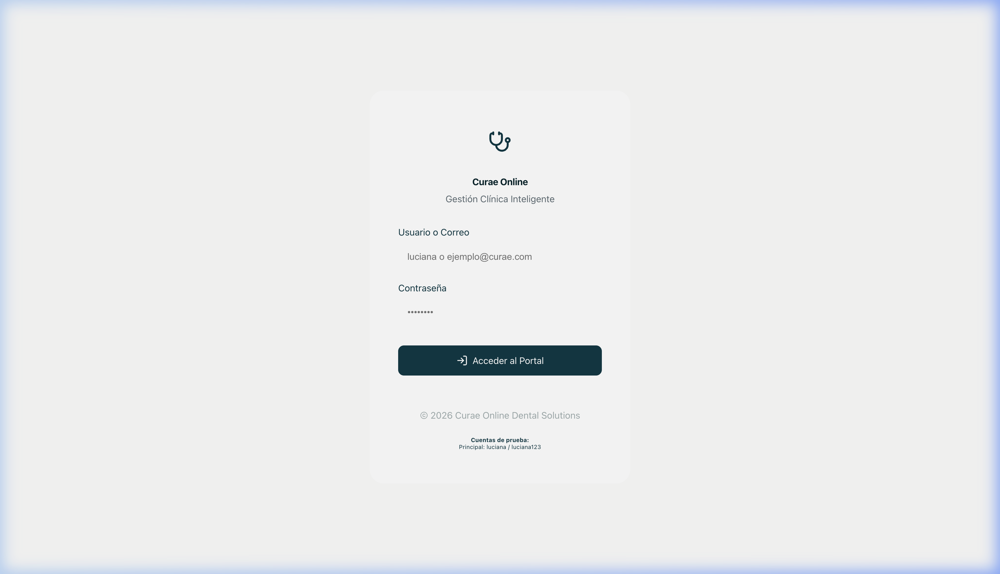
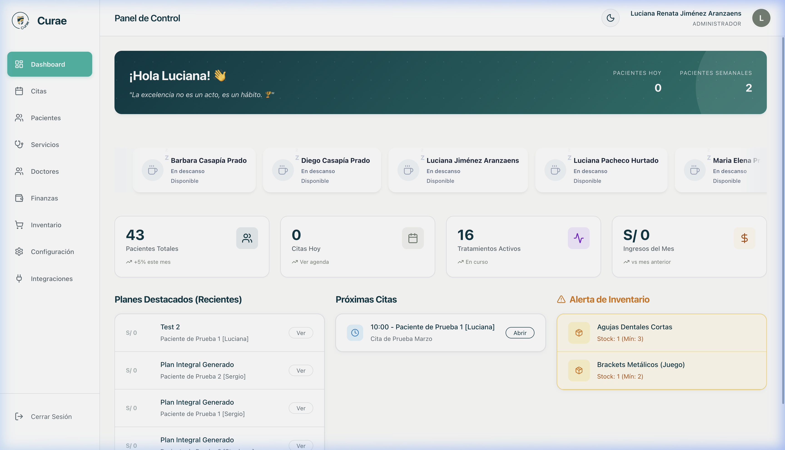
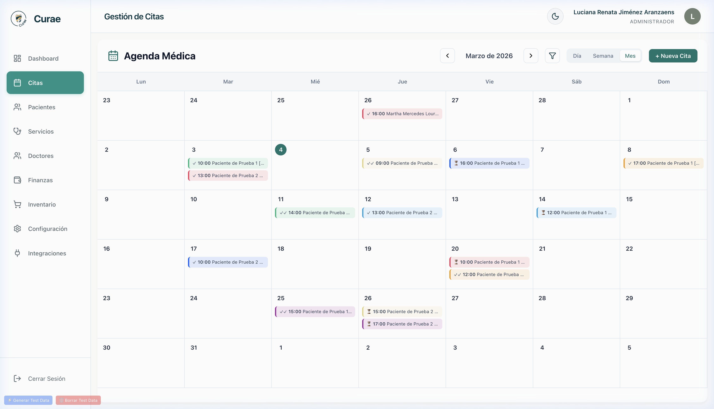
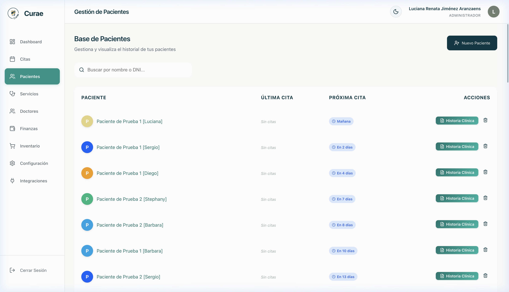
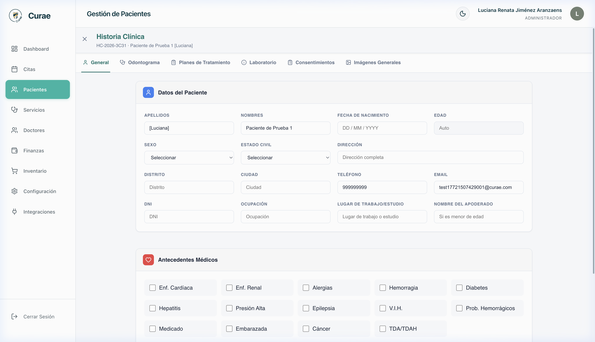
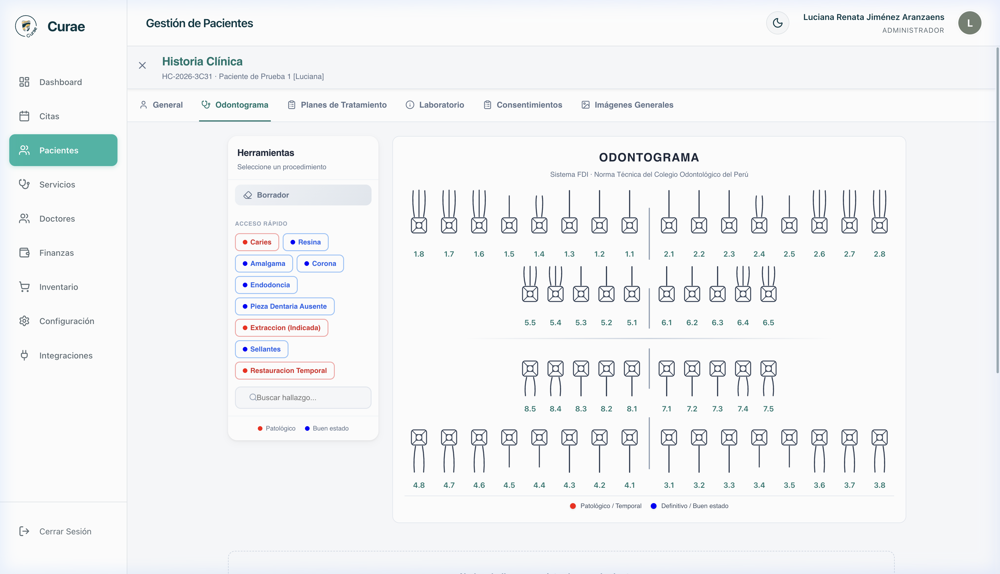
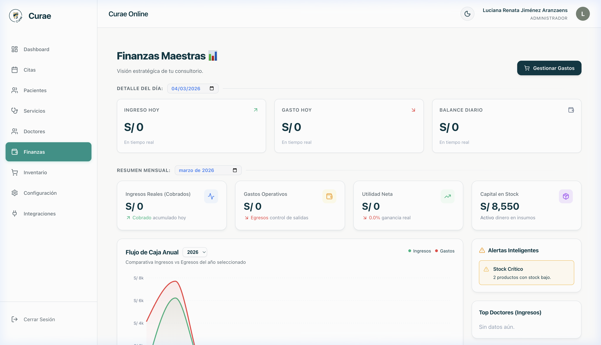
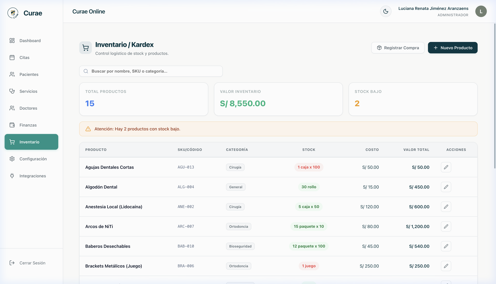
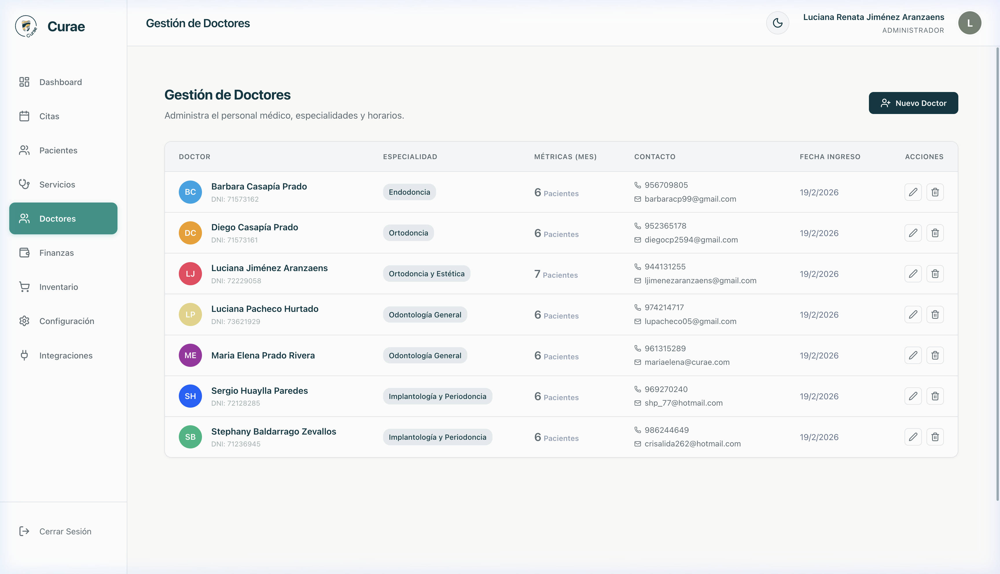

# Manual de Usuario - Curae Online

¡Bienvenido a **Curae Online**! Este sistema está diseñado para ayudarte a gestionar de forma sencilla e intuitiva todas las áreas de tu clínica dental, desde la agenda de citas hasta el inventario y las finanzas.

En este manual paso a paso aprenderás cómo utilizar las funciones principales del sistema sin necesidad de tener conocimientos técnicos.

---

## Índice

1. [Acceso al Sistema](#1-acceso-al-sistema)
2. [El Panel Principal (Dashboard)](#2-el-panel-principal-dashboard)
3. [Gestión de Citas (Agenda)](#3-gestión-de-citas-agenda)
4. [Gestión de Pacientes](#4-gestión-de-pacientes)
5. [Historia Clínica y Tratamientos](#5-historia-clínica-y-tratamientos)
6. [Catálogo de Servicios](#6-catálogo-de-servicios)
7. [Finanzas e Ingresos](#7-finanzas-e-ingresos)
8. [Inventario](#8-inventario)
9. [Gestión de Personal (Doctores)](#9-gestión-de-personal-doctores)

---

## 1. Acceso al Sistema

Para ingresar al sistema necesitas tus credenciales proveídas por el administrador.

1. Abre tu navegador web favorito (como Google Chrome o Safari).
2. Ingresa a la página de inicio de sesión de **Curae Online**.
3. Verás una pantalla pidiendo tu **Usuario / Correo** y tu **Contraseña**.
4. Escribe tus datos y haz clic en el botón **Ingresar** (o _Login_).

---

## 2. El Panel Principal (Dashboard)

Una vez que inicias sesión, lo primero que verás será el **Dashboard** o Panel Principal. Aquí tendrás una vista rápida de cómo va la clínica.

- **Indicadores Rápidos:** Verás tarjetas con resúmenes diarios, como el número de citas del día o los ingresos recientes.
- **Menú Lateral:** A la izquierda (o en la parte superior dependiendo de tu pantalla), verás el menú con todas las opciones del sistema: _Citas, Pacientes, Servicios, Inventario, Finanzas_, etc. 

---

## 3. Gestión de Citas (Agenda)

El módulo de citas es tu calendario digital donde podrás ver, agregar y cancelar las consultas de los pacientes.

**¿Cómo agregar una nueva cita?**
1. En el menú principal, haz clic en **Citas**.
2. Verás un calendario. Haz clic en el día y hora donde deseas agendar la cita. (O busca un botón que diga **Nueva Cita**).
3. Se abrirá una ventana:
   - Busca y selecciona al paciente (o regístralo si es nuevo).
   - Asigna al **Doctor** que lo atenderá.
   - Selecciona el tipo de consulta.
4. Haz clic en **Guardar**. La cita aparecerá ahora en tu calendario.

---

## 4. Gestión de Pacientes

Aquí se encuentra el directorio de todas las personas que se atienden en tu clínica.

**¿Cómo registrar un nuevo paciente?**
1. Ve al menú y selecciona **Pacientes**.
2. Haz clic en el botón **Nuevo Paciente** (o el ícono de "más").
3. Llena la ficha con los datos básicos: Nombre, apellidos, teléfono, correo electrónico, fecha de nacimiento, etc.
4. Haz clic en **Guardar**.

Al hacer clic sobre el nombre de cualquier paciente en la lista, entrarás a su **Perfil** donde podrás ver su historia clínica y la evolución de sus tratamientos.

---

## 5. Historia Clínica y Tratamientos

Dentro del perfil de un paciente, podrás llevar registro de su salud bucal.

1. **Odontograma:** Podrás visualizar un mapa de los dientes del paciente. Haz clic en piezas específicas para ir marcando el estado inicial y los procedimientos que necesite.
2. **Planes de Tratamiento:** Aquí puedes crear un presupuesto o plan para el paciente, agregando los distintos servicios que va a requerir y el costo total.
3. **Evolución:** Después de cada consulta, puedes agregar "Evoluciones" al tratamiento para llevar un texto descriptivo de lo que se le realizó ese día.

---

## 6. Catálogo de Servicios

Los servicios son los procedimientos que tu clínica ofrece y sus respectivos precios.

**¿Cómo agregar un servicio?**
1. Haz clic en **Servicios** en el menú.
2. Verás la lista de todos tus tratamientos actuales. Para agregar uno extra, haz clic en **Agregar Servicio**.
3. Coloca el nombre (Ej. _Limpieza Dental con Ultrasonido_) y el costo estándar.
4. Dale a **Guardar**. Ahora este servicio aparecerá disponible al crear Planes de Tratamiento.

---

## 7. Finanzas e Ingresos

Mantén el control del dinero que ingresa o gasta la clínica. Las finanzas están divididas.

- **Ingresos:** Se registran cuando un paciente realiza el pago de un tratamiento. Aquí puedes revisar reportes de *Ingresos Diarios* y *Mensuales*.
- **Gastos:** Así como registras dinero que entra, usa esta sección para apuntar pagos a proveedores, luz, agua, materiales, etc.

---

## 8. Inventario

Lleva un registro de los materiales de tu clínica dental para que nunca te falte nada.

1. Ve a **Inventario**.
2. Verás una lista con todos los materiales (gasas, resinas, anestésicos, etc.).
3. Puedes actualizar la "Cantidad Disponible" o crear nuevos materiales.
4. Si algo está por agotarse, el sistema podría mostrártelo en rojo.

---

## 9. Gestión de Personal (Doctores)

Si en la clínica trabajan diferentes especialistas, en este módulo podrás dar de alta a tus doctores para luego poder asignarles citas en la agenda.

1. Ve a **Doctores**.
2. Haz clic en **Agregar Doctor**.
3. Rellena su nombre, especialidad y datos de contacto.
4. Guarda los cambios.

---

### ¿Preguntas frecuentes y soporte?
- **¿Qué pasa si me equivoco al registrar algo?** En la mayoría de pantallas (pacientes, citas, etc.) tendrás botones con un ícono de un "lápiz" para editar o "basurero" para eliminar.
- **¿El sistema guarda mi información automáticamente?** Sí, cada vez que presionas los botones de "Guardar", toda la información queda respaldada en el servidor de forma segura.

Esperamos que este manual te resulte útil y agilice las tareas diarias en tu clínica. ¡Éxito en tus labores!
